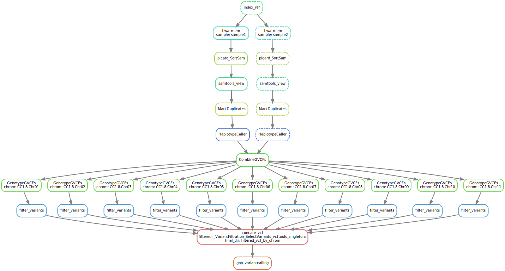

## My SNP calling pipeline from fastq files to a single analysis-ready VCF

### following GATK best practice for Germline short variant discovery

### my pipeline
`snakemake gbp_variantcalling --use-conda`

